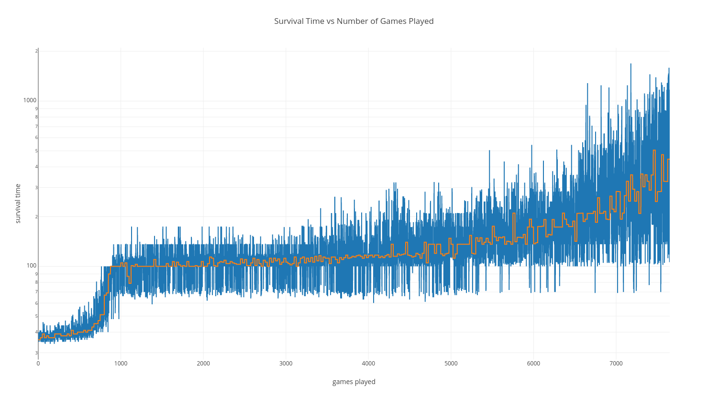

Policy Gradient Flappy Bird
===============

Policy Gradient based Deep Reinforcement Learning agent for Flappy Bird, based upon [sourabhv's FlapPyBird implementation](https://github.com/sourabhv/FlapPyBird).

Requirements
------

* Python 3, with packages:
  * NumPy
  * Multiprocessing
  * Matplotlib
  * PyGame
  * PyTorch

File Description
-----
* [controller.py](controller.py) - This is the file that is responsible for training the agent, and contains all of the meaty code that's worth looking at (which is also heavily commented).
* [demo.py](demo.py) - This file shows by default 10 episodes using the pre-trained model [model/trained-model.pt](model/trained-model.pt).
* [flappy.py](flappy.py) - This file is responsible for running and displaying the game.

Flappy Bird Modifications
------

In order to make use of sourabhv's repository for a RL agent, I first had to modify the files so that the input would no longer be given by button presses, but could be instead fed directly from an agent.
To do this, I created a input and output queues using `multiprocessing.Queue()`, and replaced key presses in [flappy.py](flappy.py) with commands taken from the input queue.
Once the action was completed, the new `state`, `reward`, and `done` status is returned to the agent via the output queue.

In addition to the above, for training purposes I replaced the background and ground by black textures, removed random pipe and bird colours, and removed all sounds. Also for training purposes I removed the FPS limitation for training mode, leaving the FPS as 30 for test mode for viewability.

I also fixed a bug where flying too high up allowed the user to score infinite points with ease (thanks to my agent finding it through exploration).

Rewards
------

I've currently defined the rewards returned by [flappy.py](flappy.py) like so:
* +1 for scoring a point (passing through a set of pipes)
* -1 for dying

These were chosen kind of arbitrarily, and it'd be interesting to see how modifying these affects training.

Pre-trained Model
------

Training can be performed using the [controller.py](controller.py) file, however a pre-trained model is also provided for convenience.

The pre-trained model, [model/trained-model.pt](model/trained-model.pt), was trained using a 4-layer network (all fully-connected):

1. 72*100 x 300, with ReLU activation
2. 300 x 300, with ReLU activation
3. 300 x 300, with ReLU activation
4. 300 x 1, with sigmoid activation

The model was trained for approx. 7,500 episodes before stopping due to time constraints, using the Adam optimiser with a learning rate of 1e-4, a discount factor of gamma = 0.99, a batch size of 25, and negative log loss. The model with the best median batch performance was selected.

The state is retrieved from PyGame as a 288 x 512 matrix, before being chopped to a 288 x 400 matrix to remove the ground below the pipes, and then downsampled to a quarter the size, giving 72 x 100.

The output is the probability of flapping given the input state.

Here's the graph of survival time vs number of episodes during training, with logarithmic scale in y, and the orange line indicating the per-batch median score:

The best performing model can survive for on average approximately 500 time steps, corresponding to approximately 10 points.

It's clear from the above plot that the model has yet to converge to a final state, and so with more training the performance will almost undoubtably improve.

Demo
------

A demo can be run using the pre-trained model by running the [demo.py](demo.py) file. By default the demo will run 10 episodes.

Here's an example of how one episode might look:

An example of how to load [model/trained-model.pt](model/trained-model.pt) can also be seen in this file.

Future Work
------

In future I'd like to:

* Experiment with different gamma values
* Experiment with different network parameters
* Experiment with different rewards
* Try with higher difficulty (less distance between pipes)
* See how using background & ground sprites affects learning
* See how using random bird & pipe colours affects learning
* Try using other architectures, such as convnets
